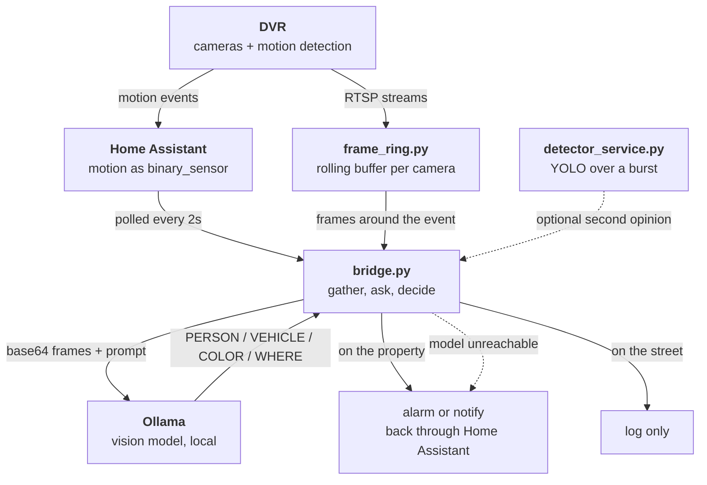

+++
title = "The alarm was dead and every monitor was green"
date = 2026-10-02
[taxonomies]
tags = ["home-security", "home-assistant", "homelab", "security", "privacy", "vlm", "local-llm", "ollama", "ai"]
[extra]
mermaid = true
+++

The house was broken into once. The people who did it cut the power and waited about two hours for the backup to run out. That detail is the whole reason I stopped treating the security system as a gadget and started treating it as something that has to work when nobody is watching it.

So there is a small server at home now. A Raspberry Pi runs Home Assistant, a recorder holds five cameras, an alarm panel covers the doors and the perimeter, a Zigbee mesh handles contacts and switches, and a Mac with a GPU runs qwen3-vl, a vision model, that looks at motion clips and says what is in them. Nothing goes to a vendor cloud. A monitoring service runs on a VPS outside the house, because a house cannot report its own blackout.

I spent a day rewiring part of it. By the end, the alarm had been unreachable for two hours, the cameras had stopped analysing anything, and the dashboard was green the entire time.

## Everything was green because I was checking the wrong thing

The alarm monitor checked that port 9009 accepted a TCP connection. It did. All day. What it did not do was answer.

I found it by replaying the panel's own protocol by hand: connect, send the auth packet, read the reply. The connection succeeded and the panel returned zero bytes, then timed out. A wrong password gives you a rejection. Silence means the listener is up and the service behind it is dead. The network module had come back from a power cut with its TCP accept loop running and nothing behind it.

The same shape had already bitten me that morning with the vision model. Its status endpoint answered instantly while every single inference hung forever. The monitor polled the status endpoint.

Both monitors were honest. They were measuring whether something was listening, which is almost never the question you care about.

So I replaced them. The alarm check now reads the panel's state through Home Assistant, which fails if the panel stops answering. The vision check asks the model to actually generate two tokens. The recorder check makes an HTTP request and accepts a 401, because a 401 proves the service parsed the request and decided to challenge, while a dead box refuses or times out.

The best one crosses machines. The vision chain is only healthy if the Mac can still pull frames from the recorder, so that check fetches a frame and requires it to be a JPEG over a certain size. One check, three machines, and it fails if any link between them breaks. An empty 200 does not pass.

## Silence is ambiguous and you have to make it loud

There is a battery camera on the gate. It sleeps almost all the time and wakes on motion. From the network it is indistinguishable from a camera that is dead, out of battery, or stolen.

The same problem shows up everywhere once you look. A door sensor that only transmits when the door opens. A job that pulls clips and finds none. A detection pipeline with nothing to detect. In every case "no news" has two readings and only one of them is good.

The fix is not clever, it is just deciding in advance how long silence is allowed to last. The camera watcher raises an alert after thirty six hours with no contact. A rejected password used to return the same "no connection" as a sleeping camera, so now it logs and notifies separately, because a stale credential should never look like a quiet night.

Related trap: a Zigbee device being joined and a Zigbee device being reachable are different facts. The bridge happily reported twelve devices joined while only two were in contact. Joined is a stored relationship. Reachable is a measurement. Reading the first and believing the second cost me an hour.

## Telling a model what it is looking at makes it ignore what it sees

The clip pipeline pulls a motion recording off the camera, extracts a frame, and asks a local vision model to describe it in one sentence.

My first prompt said the camera was mounted on a gate looking at the street. Shown a frame with a person filling most of it, the model answered that no subjects were visible, and that this appeared to be an interior shot of a person seated indoors.

It saw the person. It then dismissed the person for failing to match the scene I had promised it. I had written the filter myself.

The same model, same frame, with the scene description removed, answered in one second: "a bearded man in a grey sweatshirt is seated in a chair, holding a phone".

Context that sounds helpful becomes a filter that suppresses anything unexpected, and unexpected is the entire job of a security camera. The prompt now asks whether a person is present and then for one sentence. Nothing about where the camera is.

I pulled this part out into [vlm-security](https://github.com/gabrielkoerich/vlm-security), which is the smallest version of the idea: camera motion comes in, a local model decides whether it is worth raising an alarm, and nothing leaves the house. That repo is the piece I would start from if I were building this again, because deciding whether motion matters at all is the part that makes the rest worth having.

The dotted line from the model back to the alarm is the part worth copying. If the vision host cannot be reached, the alarm is raised anyway while the system is armed. A dead model must not quietly become a disabled alarm.

## The failures that look like success

Three of these cost me real time, and they are all the same kind: something reported that it had worked.

**A download that returned the acknowledgement.** Pulling clips off the camera failed silently because I had two protocol opcodes backwards. The device replied with a cheerful success code and sent no video. A successful handshake followed by nothing reads like a permissions problem, so the protocol was the last thing I suspected. Then the sixty eight byte error acknowledgement got written to disk as a clip, and sixty eight is not zero, so my "did it download" check passed and marked the clip done. Anything under twenty kilobytes is now a failure.

**A write that never arrived.** I set a gate motor's run time and the dashboard showed the new value. The radio was busy at that moment, the write never reached the device, and the screen was showing me what I had asked for instead of what the device had. A reboot resynced it to the real value and the change was gone. Now I confirm the device echoed it back.

**A restart that did not restart.** Twice I was told the machine had been rebooted. Uptime said otherwise both times. Restarting the application and rebooting the host are different buttons that sound the same, and only one of them resets the radio I was trying to fix.

## Things that come back, and the one that did not

Everything has to start itself, because the night this matters the power will be out and nobody will be there to bring it back by hand. Most of it does.

One bridge never did. It had a retry loop around its work, which looked like enough. It was not, because the crash happened at import: the thing reads a token when the module loads, and at boot that token is not ready yet. The process died before its own loop existed. The startup script ran it once, so it stayed dead until I noticed, which is a bad property for the thing watching your front door.

A loop inside a process cannot catch a failure that happens before the loop runs. It is now wrapped in a shell loop that relaunches it, which covers both.

Same problem, harder to spot: after a reboot, the recorder's basic motion events resumed on their own but its human detection events did not. The AI pipeline triggers only on human detection. So every entity looked available, basic motion ticked away, and the thing that actually reads the cameras had been blind for hours. That one now reloads itself two minutes after every start.

## What it costs

**Local only means you are the operator.** No vendor is watching this at 3am. When the mesh dropped, nobody paged me, I just happened to look.

**Battery cameras cannot be summoned.** I checked the protocol, the firmware, and two open source reimplementations. There is no wake command, no magic packet, and a sleeping camera answers nothing. You can be ready for it to appear. You cannot call it. If you want a camera that is always there, run a cable.

**Every address will move.** The recorder, the alarm panel and the solar logger have all changed address on me, one of them four times in a day. Anything that matters gets found by hardware address or pinned, never typed into a config file.

**Resistive heating will eat your backup.** The office was on a temporary battery while I worked. I switched on an electric heater and took the whole room down, including the server and the Zigbee coordinator. Then I spent an hour debugging the software that had been perfectly fine.

## What I would tell myself at the start

Build the monitoring to fail when the thing stops being useful, not when a port closes. That is the only part of this that applies anywhere else.

The rest is specific and a bit boring: identify devices by hardware address, decide how much silence is allowed before you call it a fault, make anything unattended restart itself including when it dies on the first line, and do not tell a model what it is about to see.

And finish the physical work before you debug the software. I lost most of an afternoon chasing a dead Zigbee mesh that was really a heater, an overloaded battery, and a room that kept losing power while I theorised about radio interference.

## Where this goes next

The model doing the describing is `qwen3-vl:4b-instruct` through Ollama. It is a general model doing one very specific job, which is why the prompt mattered so much. It has never seen this gate. It does not know which patch of ground is the street and which is the drive, so I tell it in a prompt every time, and that is exactly the paragraph that made it ignore a person standing in front of it.

Every event already saves the frame and what the model said about it. After a few months that is a record of what actually happens at one house, at every hour, in every light, including the boring frames where nothing happened, which are the ones a general model never trains on.

So the plan is to stop renting a general model and build a small one on that. Trained on this view, it would not need to be told where the street is, because it would have seen the street ten thousand times.

I will write about the small model when there is something to show. Until then, the MVP of the idea is here: [github.com/gabrielkoerich/vlm-security](https://github.com/gabrielkoerich/vlm-security)
